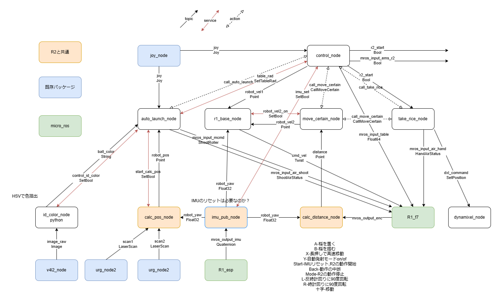
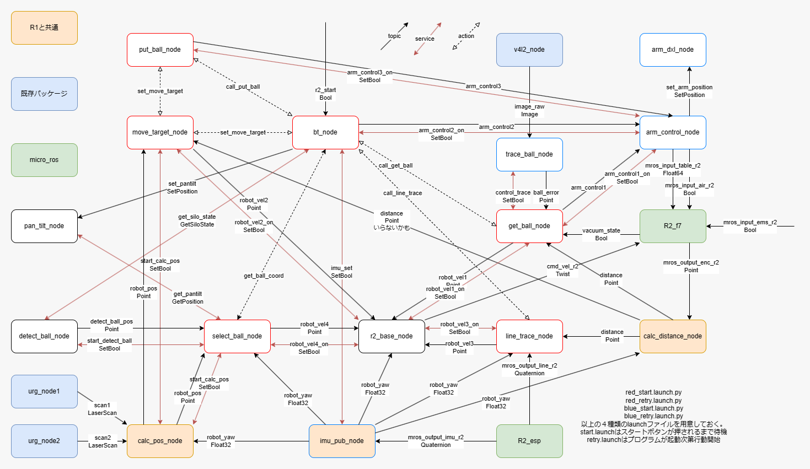
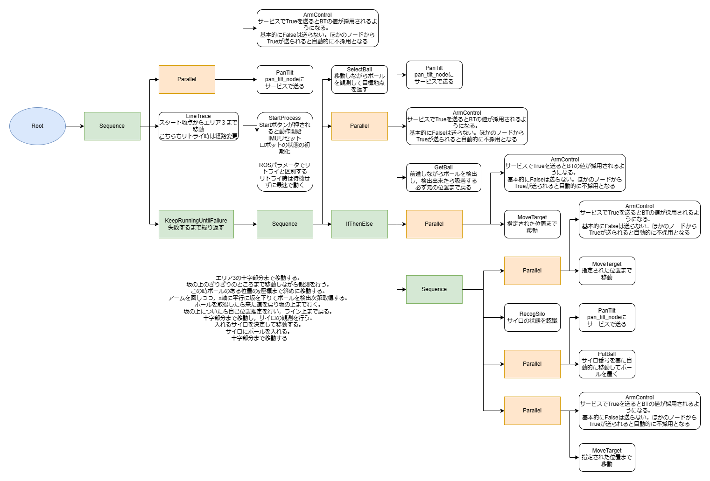

# NHK2024
このリポジトリは基本的にegitを使う事を想定していません。CubeIDEから直接クローンしてもうまくいかないと思うので，別の方法でクローンしてからプロジェクトを開くようにしてください。

## R1起動手順
1. F7に給電を開始する
2. R1の電源を入れる
3. launchファイルを実行(micro_ros)
4. ESPに給電を開始する 
※LiDARの起動について追記すること

## R2起動手順
1. F7に給電を開始する
2. R2の電源を入れる
3. launchファイルを実行(micro_ros)
4. ESPに給電を開始する

## フォルダ構造
```
NHK2024
├─ArduinoIDE
│  ├─Library
│  ├─r1_esp
│  └─r2_esp
├─CubeIDE
│  ├─omni_test
│  ├─r1_f7
│  └─r2_f7
├─Unity
│  └─R1Controller
└─NHK_ROS
   ├─r1_ros
   └─r2_ros
```
上はあくまでも参考程度のもの。適当に使ってよい。

編集する際は必ず先にPullする事！
試験的な更新の場合はブランチを切る事！

## 実行に必要なパッケージ
### ROS2
 - joy
```
sudo apt install ros-humble-joy-linux
sudo apt install ros-humble-joy-linux-dbgsym
```
 - v4l2_camera
```
sudo apt install ros-humble-v4l2-camera
```
 - usb_cam
```
sudo apt install ros-humble-usb-cam
```
 - urg_node2
```
cd ~/ros2_ws/src
git clone https://github.com/Hokuyo-aut/urg_node2.git
cd ~/ros2_ws
colcon build
```
 - dynamixel_sdk
```
sudo apt install ros-humble-dynamixel-sdk
```
 - micro_ros

https://kikaiken.esa.io/posts/197

 - BehaviorTree

https://kikaiken.esa.io/posts/224

bt用にnlohmann_jsonも必要かも
```
sudo apt install nlohmann-json3-dev
```
自分の環境ではnlohmann_jsonのインストール後にcolcon buildを実行するとエラーが出たので，注意すること。たしか/ros2_ws/install, buildフォルダを削除してからcolcon buildを実行したらうまくいった気がする。
### Python
 - pytorch
 - pyrealsense2
 - ultralitycs

## メモ
v4l2_camera_nodeでデバイスを指定する方法
```
ros2 run v4l2_camera v4l2_camera_node --ros-args --param video_device:="/dev/video2"
```
ターミナルからaction serverに目標値を送る方法
```
ros2 action send_goal <action_name> <action_type> <values>
```
example
```
ros2 action send_goal /r2/set_move_target actuator_custom_msgs/action/SetMoveTarget "{x: 4.285, y: 2.0}" 
```
普通にタブ補完で出てきたコマンドが間違っている場合もあるので注意。


pingやsshはできるのにROSの端末間通信だけできない時は，以下のコマンドを試してみる。
```
sudo systemctl stop firewalld
```
usb LiDARが使えないときは
```
sudo chmod 777 /dev/ttyACM0
```
udev ruleによるデバイスの名前変更

https://zenn.dev/karaage0703/articles/d6759ea297dbf8

## システムの全体像
### R1のROS



### R1の操作
|ボタン|機能|
|---|---|
|左スティック|移動|
|右スティック|使わない|
|十字|500mm移動|
|X|長押しで高速移動(十字移動には効果なし)|
|A|稲を置く, 自動発射モード中は発射|
|B|稲を掴む|
|Y|自動発射モードon/of|
|LB|反時計回りに90度回転|
|RB|時計回りに90度回転|
|LT|ターンテーブル反時計回り|
|RT|ターンテーブル時計回り|
|BACK|R2の動作停止|
|START|IMUリセット，R1・R2の動作開始|

状況によって変更の可能性あり！ `NHK_ROS/R1/cpp1_nhk/src/control_node.cpp`を見るのが確実！

### R2のROS


### R2のBT



## トピック名一覧
トピック名|部位|メッセージ型|仕様
---|---|---|---
R1|
cmd_vel|足回り|Twist|linear.x[m/s] linear.y[m/s] angular.z[rad/s]
mros_input_air_hand|稲用エアシリンダ|HandAirStatus|それぞれのon/off
mros_input_air_shoot|発射機構用エアシリンダ|ShootAirStatus|それぞれのon/off
mros_input_mcmd|発射ローラー|ShootRoller|各ローラーのDutyを指定
mros_input_table|ターンテーブル|Float64|rad/s
mros_output_imu|IMU|Quaternion|SparkFunライブラリの値をPublish
image_raw|機体中央のwebカメラ|Image|画像
scan1|機体左側のLiDAR|LaserScan|点群
scan2|機体右側のLiDAR|LaserScan|点群
joy|コントローラ|Joy|コントローラの値
R2|
cmd_vel_r2|足回り|Twist|linear.x[m/s] linear.y[m/s] angular.z[rad/s]
mros_input_air_r2|吸着|Bool|掴む/離すの二状態
mros_input_table_r2|ターンテーブル|Float64|rad/s
mros_output_enc_r2|転がしエンコーダ|Point|x[m] y[m]
mros_input_ems_r2|緊急停止|Bool|trueで停止
mros_output_line_r2|ラインセンサ|Quaternion|x↑y→z↓w← [0.0, 1.0]
mros_output_imu_r2|IMU|Quaternion|SparkFunライブラリの値をPublish
image_raw|アーム先端のwebカメラ|Image|画像
scan1|機体左側のLiDAR|LaserScan|点群
scan2|機体右側のLiDAR|LaserScan|点群